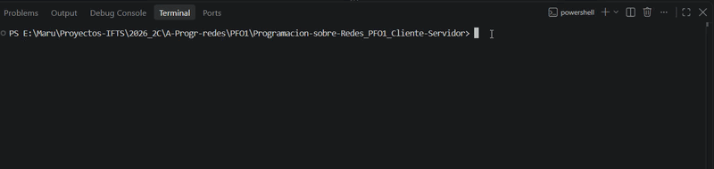
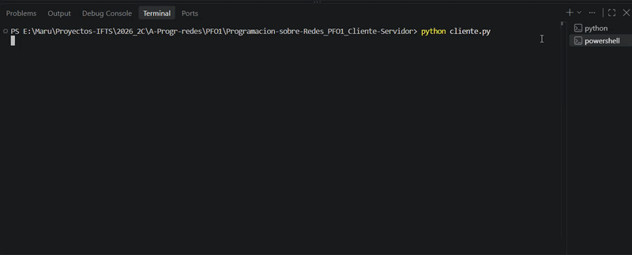
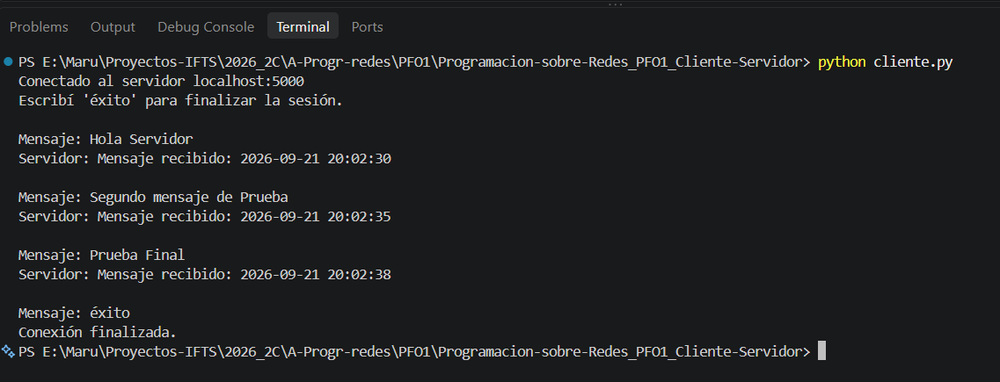
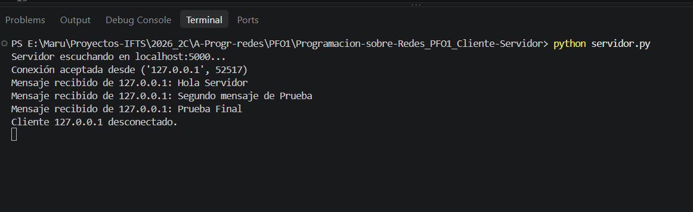
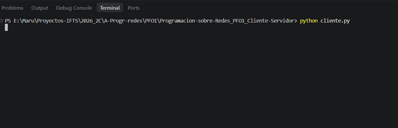
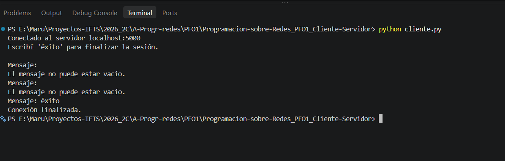
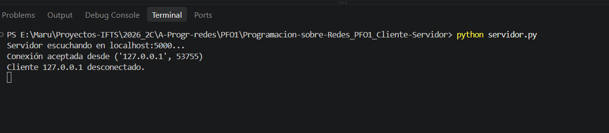
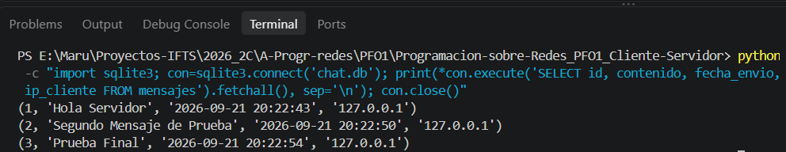

<div align="center">

# PFO1 - Chat Básico Cliente-Servidor

## Programación sobre Redes

<br>


</div>

<br>

---

## 📚 Datos del Proyecto

-  **Institución:** IFTS N.º 29   
-  **Carrera:** Tecnicatura Superior en Desarrollo de Software   
-  **Materia:** Programación sobre Redes  
-  **Estudiante:** Mariana Aiello  
-  **Repositorio:** [Programacion-sobre-Redes_PFO1_Cliente-Servidor](https://github.com/Aiello-M/Programacion-sobre-Redes_PFO1_Cliente-Servidor)

<br>


---

## 📖 Descripción del Proyecto

Este repositorio corresponde a la **Propuesta Formativa Obligatoria 1 (PFO1)** de la materia **Programación sobre Redes**.

El proyecto implementa un chat básico basado en el modelo **Cliente-Servidor**, utilizando sockets TCP/IP para establecer la comunicación entre ambos programas.

El servidor escucha conexiones en `localhost:5000`, recibe los mensajes enviados por el cliente y los almacena en una base de datos SQLite junto con la fecha y hora de recepción y la dirección IP del cliente.

Luego de almacenar cada mensaje, el servidor envía una confirmación con el formato:
```text
Mensaje recibido: <timestamp>
```

El cliente puede enviar múltiples mensajes dentro de una misma conexión hasta que el usuario escriba `éxito`.

<br>

---

## 🎯 Objetivo

Aplicar los conceptos del modelo **Cliente-Servidor** y la comunicación mediante **Sockets TCP/IP**, incorporando además persistencia de datos con SQLite.

Se busca implementar:

- Comunicación entre cliente y servidor mediante sockets.
- Envío y recepción de múltiples mensajes.
- Persistencia de los mensajes recibidos.
- Registro de fecha, hora e IP del cliente.
- Respuestas de confirmación desde el servidor.
- Modularización mediante funciones.
- Manejo de errores de conexión, socket y base de datos.
- Cierre adecuado de los recursos utilizados.

<br>

---

## 🔄 Funcionamiento General

El flujo de comunicación implementado es el siguiente:

```text
┌─────────────┐                             ┌─────────────┐
│   CLIENTE   │                             │  SERVIDOR   │
└──────┬──────┘                             └──────┬──────┘
       │                                           │
       │──── Conexión localhost:5000 ─────────────>│
       │                                           │
       │──── Mensaje enviado ─────────────────────>│
       │                                           │
       │                                      Recibe mensaje
       │                                           │
       │                                      Guarda en SQLite
       │                                           │
       │<──── "Mensaje recibido: timestamp" ───────│
       │                                           │
       │──── Nuevo mensaje ───────────────────────>│
       │                                           │
       │                  ...                      │
       │                                           │
  Usuario escribe                                  │
     "éxito"                                       │
       │                                           │
       └──────── Cierre de conexión ──────────────>│
```

Funcionamiento durante la sesión:

1. Se le solicita al usuario que ingrese un mensaje.
2. Se verifica si el usuario escribió `éxito` y, en ese caso, finaliza la sesión y se cierra la conexión.
3. Si el mensaje está vacío, no se envía y el programa vuelve a solicitar uno nuevo.
4. Si el mensaje es válido, se codifica en UTF-8 y se envía al servidor mediante el socket.
5. El servidor recibe el mensaje, registra la fecha y hora, y lo almacena en SQLite junto con la IP del cliente.
6. El servidor envía una confirmación con el formato `Mensaje recibido: <timestamp>`.
7. El programa cliente recibe la respuesta, la decodifica y la muestra en pantalla.

> Este intercambio puede repetirse múltiples veces dentro de una misma conexión, hasta que el usuario escriba `éxito`.

<br>

---

## 📂 Estructura del Proyecto

```text
Programacion-sobre-Redes_PFO1_Cliente-Servidor/
│
├── servidor.py            # Servidor TCP/IP y gestión de la base de datos
├── cliente.py             # Cliente TCP/IP e interacción con el usuario
├── .gitignore             # Archivos excluidos del repositorio
├── README.md              # Documentación del proyecto
│
└── assets/                # Recursos utilizados en el README
    ├── imgPerfil.jpg
    ├── test-servidor.gif
    ├── test-mensajes.gif
    ├── test-mensajes-cliente.png
    ├── test-mensajes-servidor.png
    ├── test-mensajes-vacios.gif
    ├── test-mensajes-vacios-cliente.png
    ├── test-mensajes-vacios-servidor.png
    └── test-base-datos.png
```

> **Nota:** La base de datos `chat.db` no se almacena en el repositorio.  
> Se genera automáticamente al ejecutar el servidor por primera vez.

<br>

---

## 🖥️ Servidor

El archivo `servidor.py` es responsable de iniciar el socket TCP/IP, aceptar conexiones de clientes, recibir los mensajes y almacenarlos en SQLite.

### Configuración

```python
HOST = "localhost"
PORT = 5000
DB_NAME = "chat.db"
```

El servidor utiliza:

- `localhost` como host.
- Puerto `5000`.
- Protocolo TCP.
- Base de datos SQLite `chat.db`.

### Funciones principales

| Función | Descripción |
| :--- | :--- |
| `inicializar_bd()` | Abre la conexión con SQLite y crea la tabla `mensajes` si todavía no existe. |
| `inicializar_socket()` | Crea el socket TCP/IP, lo vincula con `localhost:5000` y lo deja escuchando conexiones entrantes. |
| `guardar_mensaje()` | Inserta en la base de datos el contenido del mensaje, su fecha de envío y la IP del cliente. |
| `atender_cliente()` | Recibe los mensajes enviados por un cliente conectado, solicita su almacenamiento y envía la respuesta correspondiente. |
| `aceptar_conexiones()` | Mantiene al servidor esperando conexiones y deriva cada cliente aceptado a `atender_cliente()`. |
| `ejecutar_servidor()` | Coordina la inicialización de la base de datos y del socket, la ejecución del servidor y el manejo de errores principales. |

### Manejo de errores

El servidor contempla errores relacionados con:

- Acceso o inicialización de la base de datos SQLite.
- Inicialización del socket.
- Puerto ocupado.
- Errores producidos al guardar mensajes.

En caso de finalizar la ejecución, la conexión con la base de datos se cierra mediante un bloque `finally`.

<br>

---

## 👤 Cliente

El archivo `cliente.py` establece la conexión con el servidor y gestiona la interacción con el usuario, permitiéndole enviar múltiples mensajes.

### Funciones principales

| Función | Descripción |
| :--- | :--- |
| `conectar_servidor()` | Crea el socket TCP/IP del cliente y establece la conexión con `localhost:5000`. |
| `gestionar_mensajes()` | Gestiona los mensajes ingresados por el usuario y el intercambio de datos con el servidor hasta finalizar la sesión (el usuario escribe `éxito`). |
| `ejecutar_cliente()` | Coordina la ejecución del cliente y maneja posibles errores de conexión o de red. |

<br>

---

## 💾 Base de Datos

Los mensajes recibidos por el servidor se almacenan utilizando **SQLite**.

La base de datos utiliza una tabla llamada `mensajes`.

### Estructura

| Campo | Tipo | Descripción |
| :--- | :--- | :--- |
| `id` | INTEGER | Identificador único autoincremental del mensaje. |
| `contenido` | TEXT | Contenido enviado por el cliente. |
| `fecha_envio` | TEXT | Fecha y hora en que el servidor recibió el mensaje. |
| `ip_cliente` | TEXT | Dirección IP correspondiente al cliente conectado. |

La tabla se crea automáticamente al iniciar el servidor si todavía no existe:

```sql
CREATE TABLE IF NOT EXISTS mensajes (
    id INTEGER PRIMARY KEY AUTOINCREMENT,
    contenido TEXT NOT NULL,
    fecha_envio TEXT NOT NULL,
    ip_cliente TEXT NOT NULL
)
```

<br>

---

## ⚙️ Decisiones de Implementación

### Modularización

El código fue dividido en funciones con responsabilidades específicas para facilitar su lectura, mantenimiento y prueba.

En el servidor se separaron las tareas de:

- Inicialización de la base de datos.
- Inicialización del socket.
- Almacenamiento de mensajes.
- Atención de cada cliente conectado.
- Aceptación de nuevas conexiones.
- Coordinación general del servidor.

En el cliente se separaron:

- La conexión con el servidor.
- La gestión del intercambio de mensajes.
- La coordinación general y el manejo de errores.

<br>

### Comunicación TCP/IP

Se utilizaron sockets configurados con:

```python
socket.AF_INET
socket.SOCK_STREAM
```

`AF_INET` permite trabajar con direcciones IPv4 y `SOCK_STREAM` establece una comunicación mediante TCP.

<br>

### Codificación

Para el envío y recepción de mensajes se utiliza codificación UTF-8:

```python
# Envío
mensaje.encode("utf-8")

# Recepción
datos.decode("utf-8")
```

<br>

### Persistencia

SQLite permite almacenar los mensajes en un archivo local sin necesidad de instalar o configurar un servidor de base de datos externo.

<br>

---

## 📈 Testing

Se realizaron pruebas locales ejecutando `servidor.py` y `cliente.py` desde terminales separadas.

Se verificaron los principales comportamientos del sistema:

| Prueba | Resultado esperado | Estado |
| :--- | :--- | :---: |
| Iniciar servidor | Servidor escuchando en `localhost:5000` | ✅ |
| Conectar cliente | Conexión establecida correctamente | ✅ |
| Enviar varios mensajes | Los mensajes son procesados dentro de la misma sesión | ✅ |
| Recibir confirmación | El servidor responde con la fecha y hora de recepción | ✅ |
| Escribir `éxito` | La sesión finaliza correctamente | ✅ |
| Enviar mensaje vacío | El mensaje no se envía y se solicita uno nuevo | ✅ |
| Verificar SQLite | Los mensajes válidos quedan almacenados en `chat.db` | ✅ |

### Evidencias

#### 1. Inicio del servidor

- El servidor inicia correctamente y queda escuchando conexiones en `localhost:5000`.
<p align="center">
  
</p>


<br>

#### 2. Comunicación Cliente-Servidor

- El cliente puede enviar varios mensajes dentro de una misma sesión, recibir la confirmación del servidor y finalizar la conexión escribiendo `éxito`.
<p align="center">
  
</p>


- **Vista del cliente:**

<p align="center">
  
</p>

- **Vista del servidor (el servidor registra los mensajes recibidos y detecta correctamente la desconexión del cliente):**

<p align="center">
  
</p>


<br>

#### 3. Validación de mensajes vacíos

- Cuando el usuario intenta enviar un mensaje vacío, el cliente impide el envío y solicita ingresar un nuevo mensaje.
<p align="center">
  
</p>


- **Vista del cliente:**

<p align="center">
  
</p>

- **Vista del servidor (el servidor acepta la conexión, pero no recibe ni registra los mensajes vacíos):**

<p align="center">
  
</p>


<br>

#### 4. Persistencia en SQLite

<p align="center">
  
</p>

Los mensajes válidos quedan almacenados en la tabla `mensajes` de `chat.db`, junto con su identificador, contenido, fecha y hora de recepción e IP del cliente.

<br>

---


## 📋 Checklist

### Servidor

- ✅ Socket configurado para escuchar en `localhost:5000`.
- ✅ Código organizado en funciones con responsabilidades separadas.
- ✅ Recepción de mensajes enviados por el cliente.
- ✅ Almacenamiento de mensajes en una base de datos SQLite.
- ✅ Tabla `mensajes` con los campos requeridos: `id`, `contenido`, `fecha_envio` e `ip_cliente`.
- ✅ Manejo de errores relacionados con el acceso a la base de datos y la inicialización del socket.
- ✅ Control del error producido cuando el puerto se encuentra ocupado.
- ✅ Respuesta al cliente con el formato `Mensaje recibido: <timestamp>`.
- ✅ Comentarios incorporados en las secciones principales del código.

### Cliente

- ✅ Conexión con el servidor mediante sockets TCP/IP.
- ✅ Envío de múltiples mensajes dentro de una misma sesión.
- ✅ Finalización de la sesión cuando el usuario escribe `éxito`.
- ✅ Visualización de la respuesta enviada por el servidor para cada mensaje.
- ✅ Manejo de errores de conexión y de red.

### Testing

- ✅ Pruebas locales realizadas ejecutando primero el servidor y luego el cliente desde otra terminal.
- ✅ Persistencia de los mensajes verificada en SQLite.
- ✅ Repositorio creado en GitHub con el código fuente y la documentación del proyecto.

<br>

---

## 🛠️ Tecnologías Utilizadas

### Herramientas

- **Visual Studio Code** – Desarrollo y edición del código.
- **Git** – Control de versiones.
- **GitHub** – Alojamiento del repositorio.
  
### Lenguaje

- `Python 3` – Implementación del servidor y cliente.

### Librerías estándar de Python

- `socket` – Comunicación mediante sockets TCP/IP.
- `sqlite3` – Persistencia de los mensajes en SQLite.
- `datetime` – Generación de fecha y hora para los mensajes.
> No se requieren librerías externas ni instalación de dependencias adicionales.

<br>

---

## 🚀 Instalación y Ejecución

### 1. Clonar el repositorio e ingresar al proyecto

```bash
git clone https://github.com/Aiello-M/Programacion-sobre-Redes_PFO1_Cliente-Servidor.git
cd Programacion-sobre-Redes_PFO1_Cliente-Servidor
```

### 2. Ejecutar el servidor

Abrir una primera terminal y ejecutar:

```bash
python servidor.py
```
El servidor quedará escuchando en `localhost:5000`.

### 3. Ejecutar el cliente

Con el servidor en ejecución, abrir una segunda terminal:

```bash
python cliente.py
```
El cliente permitirá enviar múltiples mensajes y mostrará la respuesta del servidor para cada uno.


Para finalizar la sesión, escribir `éxito`.


<br>

---

## ✒️ Autora

| [<br><sub>Mariana Aiello</sub>](https://github.com/Aiello-M) |
| :---: |

**GitHub:** [github.com/Aiello-M](https://github.com/Aiello-M)

<br>


---


<div align="center">

<p>IFTS N°29 - Tecnicatura Superior en Desarrollo de Software - Programación sobre Redes</p>
<p>Desarrollado por <strong>Mariana Aiello</strong></p>
</div>

